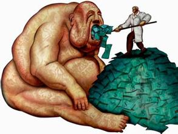

> 贪婪：指一种攫取远超过自身需求的金钱、物质财富或肉体满足等的强烈欲望。

换句话说，贪婪就是：想要原本不属于自己的东西。

回顾自己最近的投资行为，就是贪婪，真的贪婪。这可把我吓出了一身冷汗。

## 疯狂的ICO

> ICO是通过公开发售的形式来募集项目资金，与IPO募资或者找VC募资十分相似，只不过支付手段变成了比特币、以太坊等主流数字货币。
**ICO目前不需要经过监管机构的监管审查，没有专业机构的尽职调查。这为许多不具备传统渠道融资能力，没有银行贷款资质或者缺少风投资源的组织提供了新的融资渠道。**

最近比特币很火，这几个月里，已经又翻了一倍。

在同样大热的ICO市场中，各种虚拟货币层出不穷，全部都是打着“区块链”的旗号，在各个领域做不同的应用：例如预测领域，人工智能领域，医疗领域……但很奇怪的是，这些应用，几乎没有实际的运行起来！每一种币却都仅仅是概念，都是空气。

光凭扯上点“区块链”，一个ico项目就可以融资几亿人民币（甚至1亿美元也常有），这不是狂热是什么？一个辛辛苦苦打拼的公司，可能几年下来都得不到1亿的估值。万万没想到啊，一份兜售概念的白皮书，就能让几亿人民币轻松进入口袋。

在这里，我给个参考的例子：
今日头条，C轮融资1亿美金，D轮融资2亿美金。
ofo，C轮融资1.3亿美金。（请了解，ofo是重资产的企业！）

今日头条、ofo，算是鼎鼎有名了吧。他们在C轮，已经壮大的时候，才能融资1亿美金。试问，一个不知名的ICO项目，甚至它什么都还没开始做，凭什么就能够圈钱几亿人民币？

这个概念泡沫，你敢玩吗？

## 我的炒币经历

在炒币路上，我有幸加入了一个区块链投资群。在群中，我看到了很多不同的人，很多不同的做法。仅仅有极少数的人，是遵循李笑来所说的长期投资理论的；而其他人，则在币市当中追涨杀跌。

现在参加ICO、炒币，群里的朋友都是往翻倍、甚至翻几倍的目标前进的。我的妈呀！翻倍不是梦！买买买！每一个虚拟货币的K线都十分诱人。我还糊里糊涂呢，但这利润、收益率老高了，于是我也开始进入虚拟货币的市场里，打算赚一笔大的……

当时群内推荐了一些好币（比原链和印链），我毫不犹豫我就买了。虽然我不懂，但群主说好，那必须的好……

然后我就扔一边不管了（说实话，虽然我买的不大，但还是挺难忍住的）。大概一周左右，我忍不住了，回头一看，哇！比原链最高峰的时期居然翻了一倍！当然，现在又掉回原位了，但自称“长期投资者”的我，怎么会在意这点呢。实际上，看着这波澜壮阔的K线，心里是更没底了。

## 投资反思

再之后的那段时间，我的心理变化很微妙。几个问题不断的涌出来：

1. 比原链到底是个什么鬼？
2. 它真的适合长期持有吗？
3. 翻倍真的不是梦吗？
4. 如果真的这么好，那我投入多少算好呢？
5. 我需不需要再加点仓？
4. 我应该持有到什么时候？

这几个问题，不断收割我的注意力，每天不断的瞎想，心里就是没底。这种感觉很难受。说实在的，其实我心里就一直持有一个想法：`快速致富，极速翻倍。`这个想法固然无可厚非，但我现在做的，真的不是在冒险吗？

感谢群中理性的群友，他的一句话让我盘然醒悟：

> 虽然很多ICO上来就暴涨，可是那些钱根本就不是我们赚的，想要赚不属于自己的钱，这难道不是贪婪吗？

啊！其实我就是在**贪婪**，想要不属于自己的东西！例如不属于自己的钱，如我正在乱投资的比原链。我压根不了解它呀！其实我从心底里怀疑它。然而，翻倍的想法驱使着自己贪婪，自己也在不断地哄骗自己，企图让这个行为合理化。

这一刻我真正想明白了“贪婪”究竟是什么。感谢笑来老师，感谢群友，让我对“贪婪”这个概念，有了这么深刻的认识。

于是，我把手上的山寨币都卖掉了。这不是我能赚的钱，反而这会导致我错误的思考，赚这样的钱，可能会毁了我的一生。

## 君子有所为，有所不为

对待人生，我们必须足够挑剔。不要让不正确的行为污染了你的操作系统，那是病毒！例如投资自己并不了解的东西，如同“拿着火把走过了火药厂”，风险极大，而且无论结果好与坏，你的操作系统都已经植入了这种病毒，它长期影响着你，让你无法正确的思考。

这个世上充满了诱惑，如果我们不能明辨是非，分清什么是诱惑，什么是机会，而只顾拿着火把冲进去，那火药厂早晚一天会被点燃的。

“君子有所为，有所不为”。在投资路上，投资的智慧最重要。例如诸多的风险投资机构，他们也并非所有项目都投钱。他们只投自己懂的，能把投资风险降到最低的。

我们每个人就是一个风险机构。世界的机会太多，如果无法沉淀出自己的投资原则，并彻底执行它，那么最后往往是两手空空，白忙一场。

## 献上两段话

巴菲特说：

> 必须要忍受偏离你的指导方针的诱惑：如果你不愿意拥有一家公司十年,那就不要考虑拥有它十分钟。
> 更多巴菲特的名言，请复制网址查看：https://zh.wikiquote.org/zh/%E6%B2%83%E4%BC%A6%C2%B7%E5%B7%B4%E8%8F%B2%E7%89%B9

李笑来说：

> 年轻人的“奋斗精神”值得鼓励，但是概念不清晰，很容易把它推向“压上全部” 的极端。
同样的努力程度，由于年轻人的初始资本更少，即便有着相同的回报率，在绝对数量上的增长也没有那么多。
当你工资很少的时候，每个月存上20%，甚至30%，可能都没有多少钱。而对于那些中年人来说，每个月的理财收入可能都比你的薪水多。
看到这样的情景，耐心差一些的年轻人很容易就会用“压上全部”的方式来拼一把。
虽然说年轻人比中年人有更多的试错机会，但这不代表你可以肆意挥霍。当你的起点比别人低的时候，更应该好好把握每一次试错的成本。
年轻人多一点耐心，多学一些知识，不要总想着通过某次的冒险来获得巨额财富。

人生的路长着呢，哪怕找不到真的机会呢。大家一起共勉。

